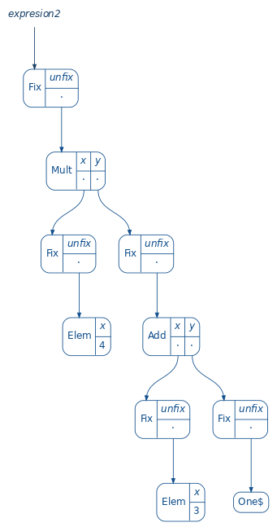
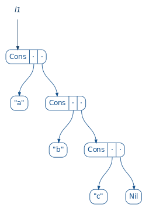
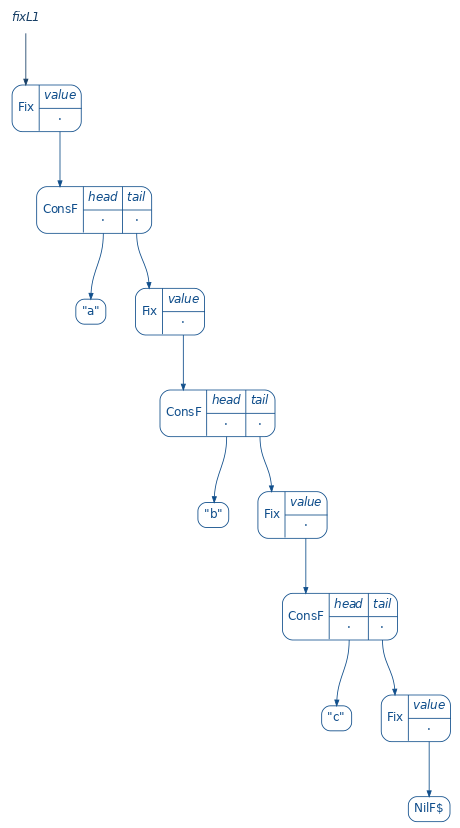
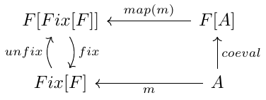

# Recursion Schemes in Scala

---

In this piece of work, I want to share some notions about recursion schemes. Recursion schemes are a paradigm based on the abstraction of the recursive steps and the base cases in recursive data types. I will try to provide some justifications about their utilities and a lot of examples where it can be usefull. All the exampes can be used as scala snippets and feel free to play with all the conctructions in Scastie. Enjoy!

## Introduction

---

I'm sure that all of you, in some way, has been heard about recursion. The idea of recursion lies in the usage of base definition and some rules to build new structures based on the previous one. One of the main examples are natural numbers, in the core of mathematics, and Lists in computer science. In both cases we have a base case that tell us an examples of an element of our structure. In the case of natural numbers, 0 is a natural number and for the case of Lists, Nil is a List. The next step is to provide a rule to build, inductively, new numbers and new lists. For the first one we have the basic rule _every natural number has a next element_. For lists, _every list is Nil or has a head of type A and a tail of type List[A]_.  It is trivial to see the similarities between the way of constructing this types. A simple implementetation of this two types in scala is:

```scala
sealed trait Nat
final object Zero extends Nat
final case class Suc(n: Nat) extends Nat

sealed trait List[+A]
final object Nil extends List[Nothing]
final case class Cons[A](head: A, tail: List[A]) extends List[A]
```

In both cases we can see the recursive construction strategy in the Cons and Suc definitions, with an argument defined by its own type. 

With every recursive structure, there are functions acting on them. We can define recursive functions acting on a inductively defined type, like Nat or Lists. For example, lets define the length of a list:

```scala
def length[A]: List[A] => Int = {
    case Nil => 0
    case Cons(h, t) => 1 + length(t)
} 
```

We can follow every step in the recursion to find the length of a given List. 

**Note:** Try to do something similar to define a recursive definition for de efunction _sum 2_ over Nat.

With these examples we can observe two behaviors:

   1) Every recursive structure use its own type to define the rule to build the next iteration.
    
   2) Every function with a domain over the a recursive Type needs to traverse the structure until the base case and them iterates to produce the result.
   
This observations are pretty well defined over the two examples. But there are some cases where the definition of the case cases (for function evaluation an recursive types) are not trivial and the recursion is not so easy to see. For these reason, it would be interesting to have a clear separation between the recursion step and the base cases definition, In fact, what we will try to build is a blueprint for general recursion The blue print is the following:

   1) Give me a funtor F[A] and a way to evaluate it for a fixed type B (think in the evaluation of an expresion to an integer)
   
   2) I have a magic type constructor to turn F[A] into its associated recursive type and a way to lift the base case evaluations to a traversavle evaluator function acting over the recursive type.
   
Lets do this.

## Functors and F-algebras

---

Lets start with a simple example. Imagine we want to implement the ring structure for the set of integers numbers, i.e, the set with multiplication and addition. The recursive version of this is:

```scala
sealed trait Ring 
case object Zero extends Ring
case object One extends Ring
case class Elem(x: Int) extends Ring
case class Add(x: Ring, y: Ring) extends Ring
case class Mult(x: Ring, y: Ring) extends Ring
```

As we have comment in the previous section, we want to separate the base cases for the recursive steps. For this porpouse, lets imagine that our base type is Int and we want to implemente it sum and mult operations. It can be defined in scala as the following:

```scala 
sealed trait RingF[+A]
case object Zero extends RingF[Nothing]
case object One extends RingF[Nothing]
case class Elem(x: Int) extends RingF[Nothing]
case class Add[A](x: A, y: A) extends RingF[A]
case class Mult[A](x:A, y: A) extends RingF[A]
```

For the definition of Ring, we can build a value as deep as we want, for example:

```scala
val expresion1 = Mult(Elem(4), Add(Elem(3), One))
```


But, for the RingF, we are able to build just base cases like Elem(7), Add(3, 4), etc. 

Lets imagine that we want to evaluate an expresion to, for example, to it associated value after resolving the operations. This can be made by the recursive function:

```scala
def toInt: Ring => Int = {
    case Zero => 0
    case One => 1
    case Elem(x) => x
    case Add(x, y) => toInt(x) + toInt(y)
    case Mult(x, y) => toInt(x) * toInt(y)
}
```
 and in Case we want to define it for RingF we can simply resolve it without recursive calls:
 
```scala
def evalToInt: RingF[Int] => Int = {
    x => x match {
        case Zero => 0
        case One => 1
        case Elem(x) => x
        case Add(x, y) => x + y
        case Mult(x, y) => x * y
    }
}
```

Here is where the magic comes, if we want to evaluate, for example, a value of the form `RingF[RingF[A]]` we need first and evaluation of the form `RingF[RingF[A]] => RingF[A]` and them another evaluatuion `RingF[A] => A`. In the previous example, A is Int. The way of doing this is based on a good property of RingF, i.e it is a functor. A functor, for our porpouses, is a type constructor with the property that we can implement a way of translating functions between tipes in functions between the constructed types by the type constructor. So for this simple example, for every type A we can build a new type `RingF[A]`. Now, given a function `f: A => B` we need to know how to build a function with the signature `fmap: RingF[A] => RingF[B]`. This can be easily define and implemented in scala in the following way:

```scala 
trait Functor[F[_]] {
    def map[A,B](f: A => B): F[A] => F[B]
}

val ringFunctor = new Functor[RingF] {
    override def map[A, B](f: A => B): RingF[A] => RingF[B] = {
        case Zero => Zero
        case One => One
        case Elem(x) => Elem(x)
        case Add(x, y) => Add(f(x), f(y))
        case Mult(x, y) => Mult(f(x), f(y))
    }
}

```

we simply encapsulate the image of f under the RingF constructor. Now that we know how to lift functions using the map property of the functor, we can lift the first step evaluation evaltoInt into a evaluation between `RingF[RingF[A]] => RingF[A]` by simply taking map with `A` as `RingF[A]` and `B` as `A` :

```scala
def liftInt: RingF[RingF[Int]] => RingF[Int] = {
    ringFunctor.map(evalToInt)
}
```

So, thanks to the map property we know how to lift one floor of recursion our base cases. Our goals now are to define the full recursive expresion and lift out evalToInt to the infinite floor of recursion. 

The argument to do this steps can be formaly made in terms of initial objects of certain cathegory, but let me try to express the idea before geting in details.If we want to find the full recursive type thats mean that we dont case abaout the depth of the expresion of our ring, so we can think about it as a type `H` related to `RingF[A]` and with an infinity depth. Its obious that an object with this two properties must to verified that `RingF[H] = H`, read as, if we are in the infinite recursive step, we dont get nothing if we repeat the aplication of `RingF`. We have to take care with this equaliaty, is better to understand that as _All the information inside `RingF[H]` is insede `H` and the converse is also true_. The equality understood as this property is called an isomorphism between the types `H` and `RingF[H]`. This is why we prefer to call `H` as `Fix[RingF]` because it is a _fixpoint_ of the equation `RingF[H] = H`. So the final signature is `Fix[RingF] = RingF[Fix[RingF]]`. Avoiding the formal and tecnical proofs, we can just implement the previous definition. Even more, this argument works for every Functor `F[A]`, so we can simply write an abstractions like:

```scala
case class Fix[F[_]](value: F[Fix[F]] )
object Fix {
  def fix[F[_]](ff: F[Fix[F]]): Fix[F] = new Fix[F](ff)
  def unfix[F[_]]: Fix[F] => F[Fix[F]] = f => f.value
}
```
fix and unfix defines the way of translating information back and forth (this functions defines the isomorphism of the fixpoint).

Now, we can build our recursive type Ring by simply fixing the RingF functor:

```scala
type Ring = Fix[RingF]
val zero = Fix[RingF](Zero)
val one =  Fix[RingF](One)
def elem: Int  => Ring = x => Fix[RingF](Elem(x))
def add: (Ring, Ring) => Ring = (x, y) =>  Fix[RingF](Add(x, y))
def mult: (Ring, Ring) => Ring = (x, y) =>  Fix[RingF](Mult(x, y))
```
and we can build recursive values like:

```scala
val expresion2 = mult(elem(4), add(elem(3), one))
```


Yow can compare this with expression1. 

We actually have reached the first goal, i.e, to find a recursive abstractionf for our starting, base cased, functor `RingF`. What its left is to take oru way to evaluate this recursive data type starting with our `evalToInt` function.

## F-algebras and Catamorphisms

----

If we take a fast recap, what we have is a functor `RingF` and our `Fix` that can transform our functor into a recursive data Type. The `Fix[]` type constructor has two functions, called fix and unfix that, as we alrready said, defines the equality `Fix[F] = F[Fix[F]]` for any functor. Our goal of lifting `evalToInt: RingF[Int] => Int` can be translated to find a function `m: Fix[F] => Int` related to `evalToInt`. Lest make a simple diagram that represent all this ideas


Looking a this diagram, if we want to define `m` we only need to follow the diagram and composing the functions, i.e, taking `m` as `eval o map(m) o unfix`. But, to understand it better, lets see first the case of `RingF` and `evalToInt`:


In this case, the recursive call comes from the call `.map(m)`, because `m` is the function we are defining. In this case, we can implement such function as 

```scala
def cata: Fix[RingF] => Int = {
    x => evalToInt(ringFunctor.map(cata)(Fix.unfix(x)))
}
val exp1 = mult(elem(4), add(elem(3), one))
cata(exp1)

res: Int = 16
```
So we are done! we achive our goal of lifting evalToInt to our recursive data type `Ring`. But, our implementation of `cata` looks pretty particular for this case. As we can see in our first diagram, we can do this for any functor and for any evaluation, i.e, an algebra over it. Lets do this in the same way, by reading the diagram:

Of course, the eval function can be parametriced as any function with signature `F[A] => A`. This kind of function is called an F-algebra over the fixed type A.


Lets start doing it simple. Lets apply it to our basic example `RingF` and `evalToInt`. In this case, our implementation of `m` should be:


```scala
def cata[F[_], A](alg: F[A] => A)(implicit F: Functor[F]): Fix[F] => A = {
    x => alg(F.map(cata(alg))(Fix.unfix(x)))
}
```
And, with this, we can call it by typing `cata(evalToInt)(ringFunctor)(exp1)`.

### A real example: Lists and folds

---

At the very begining, we talk about Lists as an essential example of recursive data type. There is as well one basic operation over Lists implemented in scala called foldLeft. What this function do is to traverse the List structure evaluating, a function with an starting value. Lest see an example of this:

```scala
val l1 = List("a", "b", "c")
```


```scala
l1.foldLeft(0)((n, t) => n + 1)

res44: Int = 3
```

We need to read foldLeft as: start with 0 and apply the function given while our next element is not Nil. This function compute the length of l1. If we look carefully, this function looks pretty similar to `cata`, where our algebra is the function acting over the base cases and then we lift it to traverse full Lists. Lets translate all of this using `Fix` and `cata`. So, lets implement our own foldLeft using cata. First, lets define the functor associated with `List`. To make it simple, we're gonna trait only `List[String]` to avoid type parameters.

```scala
sealed trait ListF[+A] 
case object NilF extends ListF[Nothing]
case class ConsF[A](head: String, tail: A) extends ListF[A]
```
And now, we can turn this `ListF` into a functor by implementing `map`:

```scala
val listOfStringFunctor = new Functor[ListF] {
 override def map[A, B](f: A => B): ListF[A] => ListF[B] = {
     case NilF => NilF
     case ConsF(h, t) => ConsF(h, f(t))
 }   
}
```

Using `Fix` we can build our own version of `l1`:

```scala
type ListString = Fix[ListF]
val nil = Fix[ListF](NilF)
def cons : (String, ListString) => ListString = (h, t) =>  Fix[ListF](ConsF(h, t))

val fixL1 = cons("a", cons("b", cons("c", nil)))
```


Finally, lets try to implement foldLeft using cata:

```scala 
def myFoldLeft[A](baseValue: A)(evaluator: (String, A) => A)(l: ListString): A = {
    def alg: ListF[A] => A = {
        case NilF => baseValue
        case ConsF(h, t) => evaluator(h, t)
        }
    cata(alg)(listOfStringFunctor)(l)

}

myFoldLeft(0)((x, y) => y + 1)(fixL1)

res35: Int = 3
```

Of course, this is just a particular case, equivalent to `List[String]`.

## F-coalgebras and Anamorphisms

---

If we think about the `evalToInt` function, what this function does is to reduce a tree of operations into an Integer. Imagine that we want to do some converse function, i.e, a function that takes an Int and produces a `Ring`. The signature for this function would be `Int => RingF[Int]`. In a more general case, we can take any fixed type `A` and any functor `F` and write `A => F[A]`. Functions with the previos signature are called F-coalgebras, because of duality with F-algebreas. 

To take an example of this kind of function, we can use a function that, given an integer, produces the esxpression of products of its factors. As we have done before, lets do this for a base case (just spliting our number in a product of two others) and then we will try to lift this function to produce the full factorization of the given number. 

For the base case, we can write:

```scala
def findDivisorsOf(r: Int): RingF[Int] = {
    def loop(n: Int): RingF[Int] = {
        n match {
            case 0 => Zero
            case 1 => One
            case x => 
                if (x >= r) Elem(x)
                else if (r%x == 0) Mult(r/x, x) 
                else loop(n+1)
        }
    }
    loop(2)
}

```

For example, `findDivisorsof(6)` produces `res55: RingF[Int] = Mult(3, 2)`, but for `findDivisorsof(12)` we only get `res55: RingF[Int] = Mult(6, 2)` and we may want to keep factorizing the 6 as `Mult(3, 2)`. To do this, we need to produce a new diagram that represent the idea of lifting this function to the `Fix` of `RingF`. This can be done by reading our first diagram, but reversing the arrows:



And, as we did before, we only need to read this diagram to get an implementation. The direct implemnetation, following the same argumens as with `cata`is 

```scala
def ana[F[_], A](coalg: A => F[A])(implicit F: Functor[F]): A => Fix[F] = {
    x => Fix((F.map(ana(coalg))(coalg(x))))
}
```

Asyou can see, this new lifter function is called ana. And now, all we need to do is to call `ana(findDivisors)(ringFunctor)(n)` to get a full expresion that represent the factorization of n. For example:

```scala
val expression3 = ana(findDivisorsOf)(ringFunctor)(12)

expression3: Fix[RingF] = Fix(
  Mult(Fix(Mult(Fix(Elem(3)), Fix(Elem(2)))), Fix(Elem(2)))
)
```


### A real example: Streams 

---

## Hylomorphisms

---

Now we can build expressions from integers using `ana`and know how to reduce it using `cata` so we can combine both reading the direct diagram:


The new function we get (`ana o cata`) is callled hylomorphism, and is pretty usefull. For example, we can use it to check that or `findDivisorsOf` and `evalToInt` rise the starting value if we did it one after another:

```scala
def hylo[A, B, F[_]](ev1: A => F[A])(ev2: F[B] => B)(implicit functor: Functor[F]): A => B = {
    x => cata(ev2)(functor)((ana(ev1)(functor)(x)))
}

hylo(findDivisorsOf)(evalToInt)(ringFunctor)(12)
---
res40: Int = 12
```

It works! But this is not so usefull, because we are getting the identity. Lets try to implemente a more fancy function. For example, lets write a simple fution to represent the factorization of an integer as a String. To do this, we need first a pretty print function and then simple apply hylo to it with findDivisorsOf.

```scala
def prettyPrint: RingF[String] => String = {
    case Zero => "0"
    case One => "1"
    case Elem(x: Int) => x.toString
    case Add(x, y) => x + " + " + y
    case Mult(x, y) => x + " * " + y
}

hylo(findDivisorsOf)(prettyPrint)(ringFunctor)(12)

---
res44: String = "3 * 2 * 2"
```

## Morphisms between recursive structures

---

We are gonne to end this talk with one last comment about recursive strctures. We have allready seen functions to evaluate (cata) and to generate (ana) recursive data types. But what if we want to use a function between recursive data Types, for example, a function `reduce: Ring => Ring` that simplifies expresions as `x + x => 2*x`. This can be made using our `Fix` and a special kind of algebra. The algebra we are gonne use has signature `RingF[Fix[RingF]] => Fix[RingF]`, because we need to work over the general recursive case. Take a look to the implementation of this:

```scala
def reduce[A]: RingF[Fix[RingF]] => Fix[RingF] = {
    case Add(x, y) => if (x == y) Fix[RingF](Mult(y, Fix[RingF](Elem(2)))) else Fix[RingF](Add(x,y))
    case other => Fix[RingF](other)
}
```

It looks pretty simple. You can compare it with its implementation using our first defined Ring without using `Fix`:

```scala
def reduce: Ring => Ring = {
    case Zero => Zero
    case One => One
    case Elem(x) => Elem(x)
    case Add(x, y) => if (x == y) Mult(reduce(x), Elem(2)) else Add(reduce(x), reduce(y))
    case Mult(x, y) => Mult(reduce(x), reduce(y))
}
```

Take a look to the shape of this function. It has a lot of recursive calls in so many places, what is error prompt and, second, its to verbose, because all is the same but for the case Add(x,x). This is one of the advantage of the recursion scheme pattern. 

## Further references

---

We have seen the recursion scheme pattern with lot of examples. The main functions has been presented but we have left under the hood some details and mathematica justifications of the results. If you want to get formal proofs of the equivalence of `Fix[F] = F[Fix[F]]` (called Lambeks lemma) and a presentation of .... 